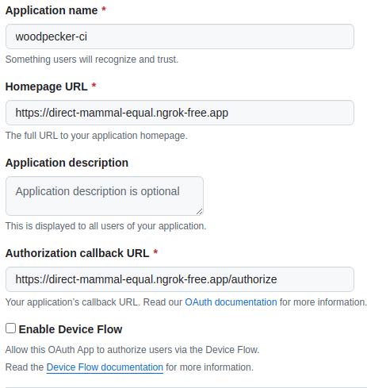

- first set up github with oauth app details with the ngrok static url:



- Set env variables as follows

```.env
WOODPECKER_OPEN=true
WOODPECKER_HOST=https://<ngrok static domain> # this is ngrok url
WOODPECKER_GITHUB=true
# github client id generated by github
WOODPECKER_GITHUB_CLIENT=<from github> 
# github token id generated by github
WOODPECKER_GITHUB_SECRET=<from github> 
# secret generated by running cmd: openssl rand -hex 32
WOODPECKER_AGENT_SECRET=<generated by the above comment>
# this server port is used for agents to communicate to server using grpc port
WOODPECKER_SERVER=woodpecker-server:9000
# ngrok auth token
NGROK_AUTHTOKEN=<ngrok auth token>
# ngrok static domain
NGROK_URL=<ngrok static domain>
```

- run docker compose up to start ci:

```sh
make start-ci
```

- Adding secrets based on ```from_secret``` variable 

- Add docker username and docker password to the ui through secrets

- Add the private key ssh to the secrets through ui add new lines in the begining and end and all the places properly otherwise you will get import error

```sh
cat ~/.ssh/id_ed25519
```


-------

## Argo CD

1. Just like other Kubernetes tools, ArgoCD requires a namespace with its name. Therefore, we will create a namespace for argocd.

```sh
kubectl create ns argocd
```

2. We will apply ArgoCD manifest installation file from ArgoCD github repository

```sh
kubectl apply -n argocd -f https://raw.githubusercontent.com/argoproj/argo-cd/stable/manifests/install.yaml
```

3. Let’s verify the installation by getting all the objects in the ArgoCD namespace.

```sh
kubectl get all -n argocd
```
4. ArgoCD User Interface - ArgoCD has a nice user interface for management.

In order to access the web GUI of ArgoCD, we need to do a port forwarding. For that we will use the argocd-server service (But make sure that pods are in a running state before running this command).

```sh
kubectl port-forward svc/argocd-server -n argocd 8080:443
```

5. You will see a privacy warning. Just ignore the warning, click on Advanced and then hit on Proceed to localhost (unsafe) to continue to the GUI interface. 

6. To use ArgoCD interface, we need to enter our credentials. The default username is admin so we can enter it immediately, but we will need to get the initial password from ArgoCD through minikube terminal.


7. Initial password is kept as a secret in the argocd namespace; therefore, we will use jsonpath query to retrieve the secret from the argocd namespace.

```sh
kubectl -n argocd get secret argocd-initial-admin-secret -o jsonpath="{.data.password}" | base64 -d; echo
```


Deploying a test app

Now that we are in the user interface, we can create a new app. The source code for my application is in my Github repo, so I will connect my Github repo to ArgoCD. (We could also hit new app and add our repo there, but I opted for this option first)

1. Click on the gear icon to open settings

2. Click on repositories

3. Click on connect repo

4. For connection method, choose HTTPS, for Project choose default, and enter your github repo as repository URL. Finally, hit on connect.

5. You should get a Successful message in terms of connection status.

6. Let’s create a new app from the repo. At the far right of the Successful message, click on the three dots. The pop up menu will have a create applicationoption. Also click that option.

7. Enter test as application name, choose default for Project Name, and choose Automatic for Sync Policy.

8. Enter repository URL (You do not have to type it down, it is already there) Enter nginx as path (My resource files are in nginx directory of my repo). Choose kubernetes.default.svc as cluster URL. Enter test as namespace (I already have a namespace object with test). Himy-node-app-7f96b5d7c5t on Create on the top

9. Click anywhere on the app to get a detailed view of the application.


https://medium.com/@mehmetodabashi/installing-argocd-on-minikube-and-deploying-a-test-application-caa68ec55fbf